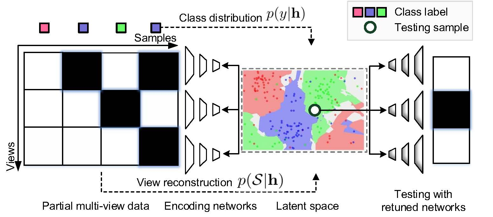

# CPM-Nets: Cross Partial Multi-View Networks

This repository contains the code for our NeurIPS'19 Spotlight paper [CPM-Nets: Cross Partial Multi-View Networks](https://github.com/hanmenghan/CPM_Nets/blob/master/paper/). Datasets can be obtained [here](https://drive.google.com/drive/folders/1TKiyL7vCq6DpFDMrQXIJdUcbVK6SIyhk?usp=sharing). 

Maybe our paper [“Trusted Multi-View Classification”](https://arxiv.org/abs/2102.02051) published by ICLR 2021 can also inspire you.

## Framework



## Requirements

- TensorFlow 1.12.0
- Python 3.6.7
- sklearn
- numpy
- scipy

## Introduction

Despite multi-view learning progressed fast in past decades, it is still challenging due to the difficulty in modeling complex correlation among different views, especially under the context of view missing. To address the challenge, we propose a novel framework termed Cross Partial Multi-View Networks (CPM-Nets). In this framework, we first give a formal definition of completeness and versatility for multi-view representation and then theoretically prove the versatility of the latent representation learned from our algorithm. To achieve the completeness, the task of learning latent multi-view representation is specifically translated to degradation process through mimicking data transmitting, such that the optimal trade off between consistence and complementarity across different views could be achieved.In contrast with methods that either complete missing views or group samples according to view-missing patterns, our model fully exploits all samples and all views to produce structured representation for interpretability. Extensive experimental results validate the effectiveness of our algorithm over existing state-of-the-arts.

## Example Experiments

This repository contains a subset of the experiments mentioned in the paper.

## Testing

Each file in the directory in the file is a demo of a data set.The optimal parameters are set in each file to achieve the accuracy mentioned in the paper.You can simply run the code in the following way.
```
python test_hand.py
```
You can adjust some of the hyperparameters in the following ways:
```
python test_hand.py --missing-rate 0.5 --lamb 10
```
In this way, you can modify the missing rate,the value of the lambda and other parameters.The number of layers and the learning rate of the network need to be modified in the file.

## Citation
If you find CPM-nets helps your research, please cite our paper:
```
@inproceedings{NEURIPS2019_11b9842e,
 author = {Zhang, Changqing and Han, Zongbo and cui, yajie and Fu, Huazhu and Zhou, Joey Tianyi and Hu, Qinghua},
 booktitle = {Advances in Neural Information Processing Systems},
 editor = {H. Wallach and H. Larochelle and A. Beygelzimer and F. d\textquotesingle Alch\'{e}-Buc and E. Fox and R. Garnett},
 pages = {},
 publisher = {Curran Associates, Inc.},
 title = {CPM-Nets: Cross Partial Multi-View Networks},
 url = {https://proceedings.neurips.cc/paper/2019/file/11b9842e0a271ff252c1903e7132cd68-Paper.pdf},
 volume = {32},
 year = {2019}
}
```

## Questions?

Please report any bugs and I will get to them ASAP. For any additional questions, feel free to email zongbo AT tju DOT edu DOT cn.
